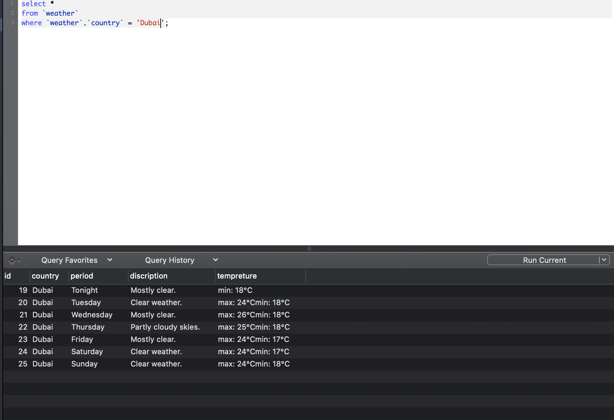

# weather-scraping

# Python Script for Scraping Data from a weathers websites and Saving it to a Database MYSql
This is a sample code to scrap out the data from two weather websites and save them in the database.


The two sample pages are [https://freemeteo.ae/weather/dubai/7-days/list/?gid=292223&language=english&country=united-arab-emirates](https://freemeteo.ae/weather/dubai/7-days/list/?gid=292223&language=english&country=united-arab-emirates) and [https://forecast.weather.gov/MapClick.php?lat=37.7772&lon=-122.4168#.XgC0fBczbRZ](https://forecast.weather.gov/MapClick.php?lat=37.7772&lon=-122.4168#.XgC0fBczbRZ)
## Requirements
1. A working version of Python 2 or Python 3.
2. MySQL software running locally and a tool like sequelpro.
3. Python libraries beautifulsoup4, pandas, SqlAlchemy and requests.
## Or you can activate the virtual enviroment using the following command
```
source scrapy/bin/activate
```
## To Start follow the steps:
1. Open your locally run MySQL software for example (Sequel Pro) and create a database with the name "scraping_sample".
2. Create a user with the username "scraping_user" and give the user the full privileges to read and modify the table "scraping_sample"
```
mysql>CREATE USER 'scraping_user'@'localhost' IDENTIFIED BY '1234';
mysql>GRANT ALL PRIVILEGES ON * . * TO 'scraping_user'@'localhost';
```
3. Go to the MySQL command line or using query terminal in Sequel Pro and execute the following commands to create the table.
```sql
CREATE TABLE `weather` (
 `id` int(10) unsigned NOT NULL AUTO_INCREMENT,
 `country` varchar(255) COLLATE utf8_unicode_ci NOT NULL,
 `period` varchar(255) COLLATE utf8_unicode_ci DEFAULT NULL,
 `discription` varchar(255) COLLATE utf8_unicode_ci DEFAULT NULL,
 `tempreture` varchar(255) COLLATE utf8_unicode_ci DEFAULT NULL,
 PRIMARY KEY (`id`)
) ENGINE=InnoDB AUTO_INCREMENT=0 DEFAULT CHARSET=utf8 COLLATE=utf8_unicode_ci;
```
4. Clone this repository into a folder
```
git@github.com:Islamnader94/weather-scraping.git
```
5. Go to the cloned folder and execute the script

For Python 3:
```
python3 weather_scraping.py
```
For Python:
```
python weather_scraping.py
```
6. Sample screenshots of queries


